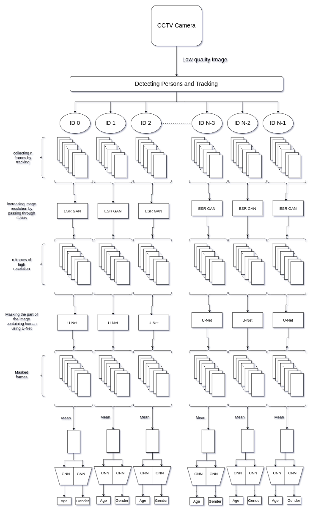

# BOSCH_A-G_INTERIIT

Repository containing **TEAM-IITBHU** Solution for BOSCH Age and Gender Detection Problem Statement in InterIIT tech meet 10.0

A snapshot for our approach is shown below : -



## INSTALLATION

**Step1** - Cloning this Repository

 - In terminal/git bash run 

 ```bash
 git clone https://github.com/Amshra267/BOSCH_A-G_INTERIIT.git
 ## move to that directory
 mkdir BOSCH_A-G_INTERIIT
 ```  

**Step 2** - We had provided two configurations for installation

 - **For GPU**(Recommended) - (Requirements -  **```CUDA version = 11.1```**)
    
     * In the above opened terminal run

     ```bash
     chmod +x install_gpu.bash
     ./install_gpu.bash
     ```

 - **For CPU**
    
     * In the above opened terminal run
     
     ```bash
     chmod +x install_cpu.bash
     ./install_cpu.bash
     ```

Now you are ready to run our solution

## TESTING

In terminal run 

```python main.py --video <path_to_your_video_file>```

Above file have some arguments:-

    --video = <path of video file> 
                 or <camera id_no in case of real time image feed
                example = 0 (for webcam ), 1 (for external camera) >
    
    --show  = 1 (for showing our output), default = 0  

    --output = <path_of_output_saved_video_result>
    
## OUTPUT FORMAT

We are creating three folders inside the outputs folder corresponding to the passed video's as an input result, persons in their cropped form and labels file having their demographic details. 

The output inside the labels.txt is in the format as follows;  Person Id : Gender , Age Range , Age

we added a test file for you in outputs/video_results folder

## DATASET USED

 - We trained Age and Gender from a Gait Rcognition Dataset **TUM-GAID DATASET** which we got from a CS Department Professor from our Institute [Dr. Pratik Chattopadhyay](https://www.iitbhu.ac.in/dept/cse/people/pratikcse). We Also took conset from them for using their dataset in our training. PDF Attached [here](data/Authorization.pdf).
 - Trained UNet on Open Source data - [OCHuman Dataset](https://cg.cs.tsinghua.edu.cn/dataset/form.html?dataset=ochuman)
 - Other models and datasets are available open source like coco for object detection. Mars dataset.

## References
 - Yolov4 (For Object Detection) - https://arxiv.org/abs/2004.10934 
 - Deep-Sort (For Object Tracking) - https://arxiv.org/abs/1703.07402
 - ESRGAN (For super resolution) - https://arxiv.org/abs/1809.00219
 - UNet (For Segmentation Mask) - https://arxiv.org/abs/1505.04597
 - Gait Recognition (For Age and Gender analysis) - https://link.springer.com/10.1007/978-1-4419-5906-5_741
